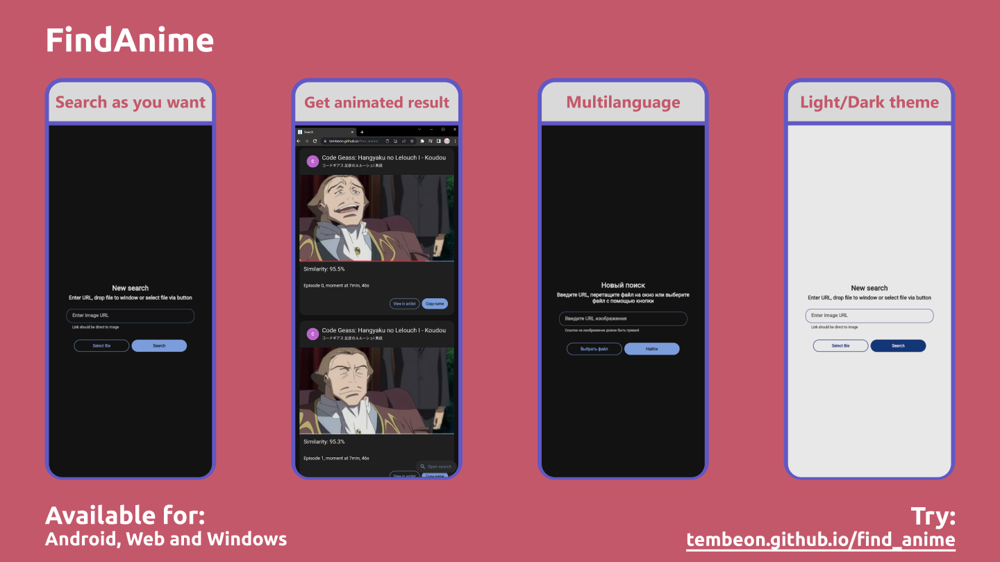
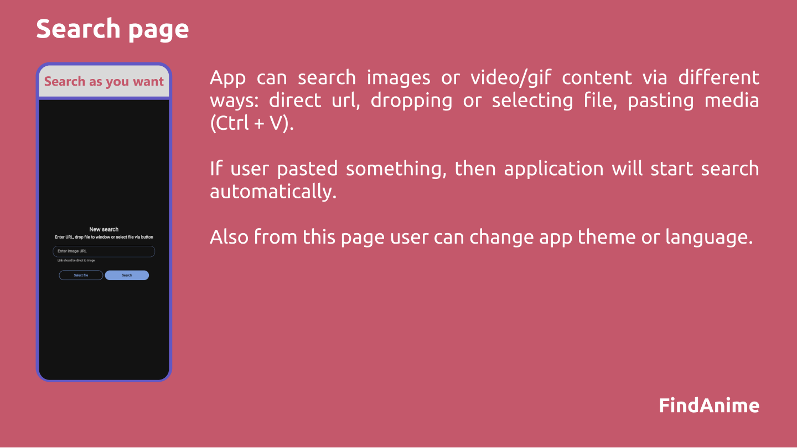
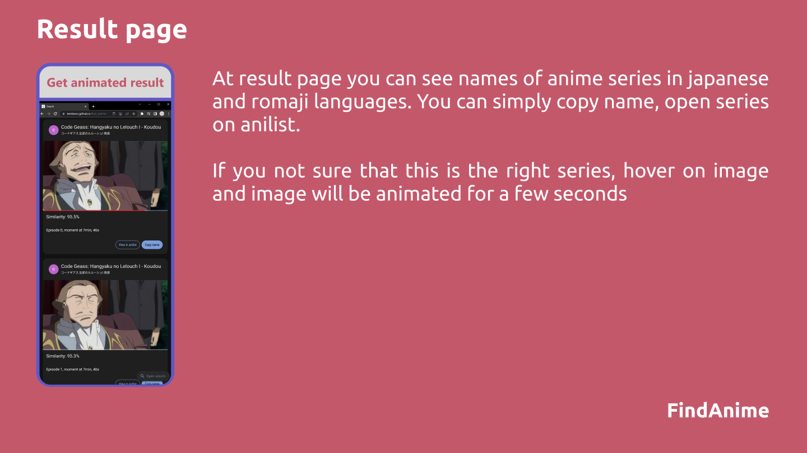

Find anime name by image or video. 

Try:
* Web - https://tembeon.github.io/find_anime/
* Android - https://github.com/Tembeon/find_anime/releases/latest

## Features
* Search via media url, dropping or selecting file, pasting content
* Light and Dark themes
* Internationalization
* Install as app to your device
* Search engine by https://trace.moe/about

## Screenshots

## How to build
1. Clone repo
2. run `flutter pub get`
3. run `flutter pub run build_runner build`
4. build project to web or mobile

### TO-DO
- [X] Add search via file drop
- [X] Add ability to choose app language
- [X] Add ability to choose app theme
- [X] Maybe: search via Ctrl + V image
- [ ] Maybe: get image via mobile sharing dialog
- [X] Maybe: compile on Windows, Android, ~~Linux~~